# OmniTask AI: Master Implementation Plan

> [!NOTE]
> This plan details the phased technical execution to build **OmniTask AI** from scratch. It is designed to be modular, robust, and verifiable at every stage.

---

## 1. System Architecture & Tech Stack

```mermaid
flowchart LR
    subgraph Frontend["Frontend & Visualizer (Next.js / React / Tailwind)"]
        UI1["Track 1: Free AI Advisor & Directory"]
        UI2["Track 2: Autonomous Execution Hub"]
        UI3["Live Agent Graph & Blackboard Visualizer"]
    end

    subgraph CoreEngine["OmniTask AI Core Engine"]
        Ingest["Data & File Ingestion"]
        Struct["JSON Structurer Agent"]
        Jev["Jev Fast Router (System 1)"]
        Blackboard[("Common Context Blackboard")]
        Workers["Specialized AI Workers\n(Code, Math, Vision, Video, Audit)"]
        Reviewers["Intermediate Domain Reviewers\n(Multimodal & Code QA)"]
        Evaluator["Final Reviewer & Scorer"]
    end

    Frontend <==>|Real-time SSE / REST| CoreEngine
```

### Proposed Stack:
* **Frontend & UI**: Next.js 14+ / React, Tailwind CSS, Lucide icons, Framer Motion for smooth agent execution telemetry.
* **Backend & Agent Engine**: Node.js / TypeScript (or Python FastAPI via `py -3.12`) with modular agent abstraction:
  * Strict schema validation (Zod / Pydantic).
  * Real-time streaming updates via Server-Sent Events (SSE) so users see each sub-agent think, write to context, and pass review in real time.
* **Model Integration**:
  * **Jev Fast Router**: Pluggable driver supporting TypeSafe Jev API (with ultra-low latency fallback / local fast classifier).
  * **Specialized Workers**: Configurable adapters for Gemini, OpenAI, Anthropic, open models, and mock/simulation mode (allowing zero-friction local testing without requiring 10 API keys upfront).
  * **Shared Blackboard**: In-memory state store with JSON persistence.

---

## 2. Phased Implementation Roadmap

### Phase 1: Core Domain Schemas & Common Context Blackboard
1. **Define Strict Data Contracts**:
   - `TaskState`: Primary objective, uploaded file assets, user constraints.
   - `JevPlan`: Ordered sub-tasks DAG, domain classifications, assigned worker models, intermediate reviewer types.
   - `BlackboardMemory`:
     - Global prerequisites and user assets.
     - Completed tasks registry.
     - Cumulative delta outputs (passed forward).
     - **Negative Knowledge & Error Registry** (captured bugs, lint warnings, avoidances).
2. **Implement Common Context Engine**:
   - Ingests initial task state.
   - Provides snapshot retrieval for worker initialization (zero cold-start).
   - Appends verified intermediate outputs.
   - Records errors and retry notes.

---

### Phase 2: Orchestration Pipeline & Jev Router
1. **JSON Structurer Agent**:
   - Parses raw natural language + uploaded files into clean typed JSON schema.
2. **Jev Fast Decision Router**:
   - Implements the System 1 classification interface (inputs typed state $\rightarrow$ outputs sub-task sequence + worker assignments in $<300\text{ms}$).
   - Pre-configured domain routing table:
     - Math / Logic $\rightarrow$ Reasoning model
     - Coding / Software $\rightarrow$ Code specialist
     - Image Generation $\rightarrow$ Visual synthesis model
     - Video / Animation $\rightarrow$ Motion synthesis model
     - Auditing / Summarization $\rightarrow$ High-context analytical model
3. **Execution & Intermediate Review Loop**:
   - Sequentially or concurrently executes sub-tasks.
   - Passes worker output directly to the **Intermediate Domain Reviewer**:
     - Multimodal reviewer for image/visual assets.
     - Static analysis & logic check for code.
   - Handles rejection/re-prompt loop: logs issue to Blackboard $\rightarrow$ re-executes worker.
4. **Final Reviewer & Scoring Agent**:
   - Measures final output against the original user prompt.
   - Computes **Completion Score** ($0-100\%$).
   - Generates internal audit log and deliverable package.

---

### Phase 3: Track 1 — Free AI Advisor & Directory Engine
1. **AI Capability Knowledge Base**:
   - Curated matrix of 40+ leading AI tools, agents, and models categorized by strengths, costs, modalities, and ideal use cases.
2. **Advisor Intelligence**:
   - Analyzes user queries and outputs a step-by-step DIY blueprint:
     - Recommended tools for each step.
     - Exact prompt templates to feed those tools.
     - Free vs. paid tool alternatives.

---

### Phase 4: Fullstack Web Application & Live Visualizer
1. **Unified Dashboard**:
   - Clean navigation between **Track 1 (Free Advisor)** and **Track 2 (Omni Autonomous Agent)**.
2. **Data & File Ingestion Panel**:
   - Drag-and-drop file upload, data input box, and natural language prompt area.
3. **Live Execution Visualizer (The Core Experience)**:
   - **Step Timeline**: Visual DAG showing active and completed tasks.
   - **Live Common Context Feed**: Real-time display of the Blackboard showing cumulative facts and the negative knowledge/error log.
   - **Intermediate Review Badges**: Visual inspection cards showing multimodal review approvals.
   - **Final Score Meter**: Circular score badge ($95\%$) with audit report and download buttons for generated artifacts.

---

### Phase 5: Verification, Testing & Demo Scenarios
1. **End-to-End Test Suite**:
   - Test Scenario A: Complex multi-modal task (e.g., "Analyze CSV sales data $\rightarrow$ Write Python regression script $\rightarrow$ Generate marketing infographic image $\rightarrow$ Audit report").
   - Test Scenario B: Track 1 recommendation query (e.g., "I want to build an automated podcast from research papers, what AIs should I use?").
2. **Error Recovery Verification**:
   - Inject an intentional error at Step 1 $\rightarrow$ Verify intermediate reviewer catches it, logs it to Blackboard, and downstream steps adapt without repeating it.
